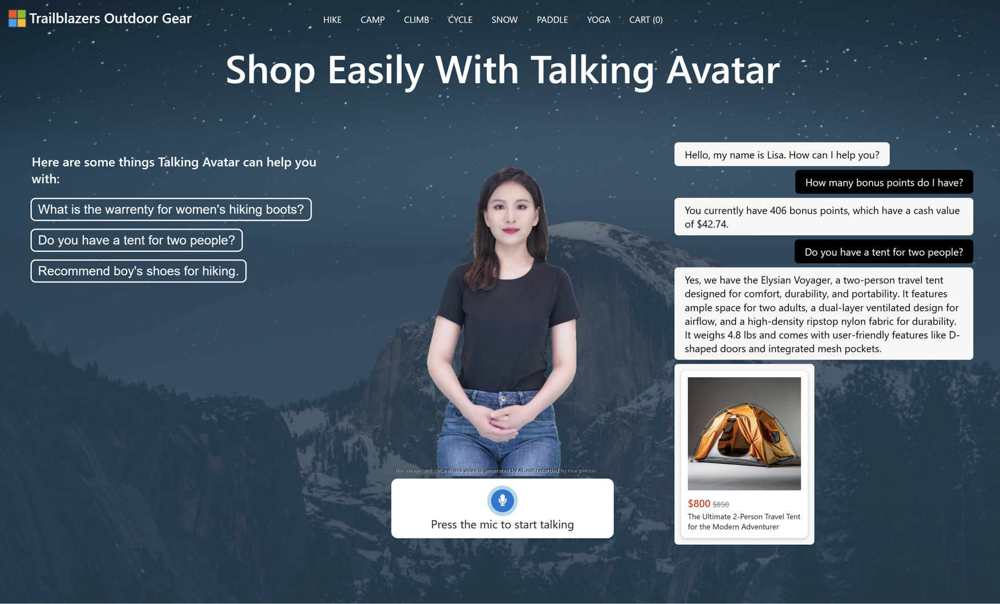

# Shop Easily Using Talking Avatar - Trailblazers Outdoor Gear



This solution accelerator can be used to deploy an application that offers an interative shopping experience using a talking avatar. It uses Azure OpenAI combined with data stored on Cognitive Search and Azure SQL to generate answers.

## Getting started

1. This application can be deployed using [Azure Static Web Apps](https://docs.microsoft.com/azure/static-web-apps/overview). Start by forking this repo and using the [quickstart](https://docs.microsoft.com/azure/static-web-apps/getting-started?tabs=vanilla-javascript) to build the application. This application is using no front-end frameworks.

3. Create the following Azure resources: 
- Azure OpenAI Service with these models deployed
  - gpt-35-turbo (version 0613 or higher)
  - text-embedding-ada-002 (verson 2)
- Azure Cognitive Search with default settings
- Azure SQL with the following settings
  - Authentication: SQL and Microsoft Entra authentication enabled
  - Networking: Allow Azure services and resources to access this server enabled
- Azure Speech Service
- Azure AI services multi-service account
- [Azure Communication Services](https://learn.microsoft.com/en-us/azure/communication-services/quickstarts/create-communication-resource?tabs=windows&pivots=platform-azp#create-azure-communication-services-resource)
- Azure Speech Service
- Azure Blob Storage account

3. Upload the images in the `product-images` directory to a blob container in the Storage Account. Generate a SAS url for the blob storage container. We will need this in a later step.

4. Create a file named `local.settings.json` in the `api` directory of the repository. Make sure to add the following variables to `local.settings.json`, and publish them to the application settings. More details on configuring application settings for Azure Static Web Apps can be found [here](https://learn.microsoft.com/en-us/azure/static-web-apps/application-settings).

```
{
  "IsEncrypted": false,
  "Values": {
    "AzureWebJobsStorage": "XXX",
    "FUNCTIONS_WORKER_RUNTIME": "python",
    "AZURE_OPENAI_ENDPOINT": "https://XXX.openai.azure.com/",
    "AZURE_OPENAI_API_KEY": "XXX",
    "AZURE_OPENAI_CHAT_DEPLOYMENT" : "gpt-35-turbo-16k",
    "AZURE_OPENAI_EMBEDDINGS_DEPLOYMENT" : "text-embedding-ada-002",
    "AZURE_OPENAI_API_VERSION" : "2023-07-01-preview",
    "AZURE_SEARCH_ENDPOINT": "https://XXX.search.windows.net",
    "AZURE_SEARCH_API_KEY": "XXX",
    "AZURE_SEARCH_INDEX": "products",
    "AZURE_SPEECH_REGION": "westeurope",
    "AZURE_SPEECH_API_KEY": "XXX",
    "TEXT_ANALYTICS_ENDPOINT": "XXX",
    "TEXT_ANALYTICS_KEY": "XXX",
    "BLOB_SAS_URL": "https://XXX",
    "SQL_DB_SERVER": "XXX.database.windows.net",
    "SQL_DB_USER": "XXX",
    "SQL_DB_PASSWORD": "XXX",
    "SQL_DB_NAME": "OutdoorEquipmentShop",
    "ICE_CONNECTION_STRING": "XXX"
  }
}
```

5. Run the cells in `create-index-and-database.ipynb` notebook to upload the product data to Azure Cognitive Search and the Azure SQL Database.

6. For running the app locally, make sure to have ODBC Driver 17 for SQL Server installed.

7. Run the application locally using the following command: `swa start src --api-location api`.
