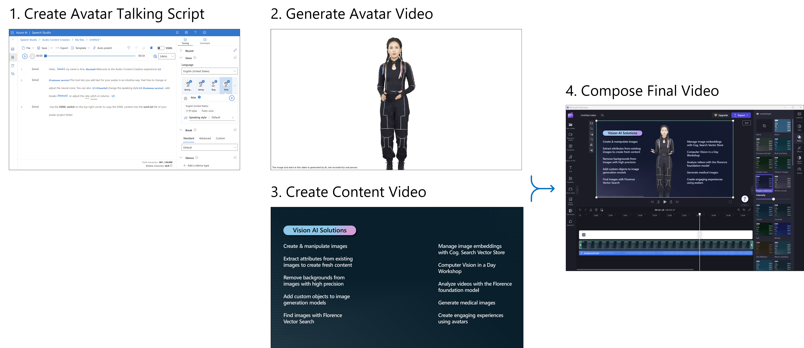

# Create engaging videos with the text to speech avatar

👩‍🦰 Avatar videos present diverse applications across various sectors:

- __Educational Content__: They transform complex educational concepts into engaging, interactive learning experiences, making information more accessible and appealing to students of all ages.
- __Corporate Communications__: These videos offer a dynamic way for businesses to communicate internally, ideal for training, updates, or HR announcements, adding a personal and relatable touch to corporate messaging.
- __News Broadcasting__: In news media, avatars can narrate stories or simulate interviews, providing a unique, engaging twist to traditional news reporting.
- __Marketing and Branding__: Avatars enable brands to create distinctive and memorable marketing campaigns, aligning with the brand's image and effectively introducing products or services to the market.

💡 Rich avatar videos are typically composed of several elements including a talking avatar video, background images or videos, background music and other elements to make the video more engaging. 

Our notebook guides you through these steps to create your own avatar videos:

1. Start with a talking script for your avatar using plaintext format or the Speech Synthesis Markup Language (SSML). SSML allows you to fine-tune the voice of your avatar including pronunciation, and the expression of special terms such as brand names, coupled with avatar gestures like a hand wave or pointing to an item. 
2. With your talking script ready, you use the Azure TTS 3.1 API to synthesize your avatar video. Besides the SSML input you can specify the character and style of the avatar (such as standing or sitting) and the desired video format.  
3. In many cases, you probably want to add a content image or a video with text, illustrations, animations etc. to the final video. You can export an animated PowerPoint presentation as a high-resolution video for this purpose.
4. Finally, combine your assets including the avatar video, content, and optional elements like background music to compose your rich video experience. This can either be done using the FFmpeg tool or a video editor like ClipChamp for more control. Using a video editor provides an intuitive way to fine-tune the timings of the video, add engaging effects and animations.

➡️ Feel free to get started with the [notebook](./create-avatar-video.ipynb) to create your first avatar video.