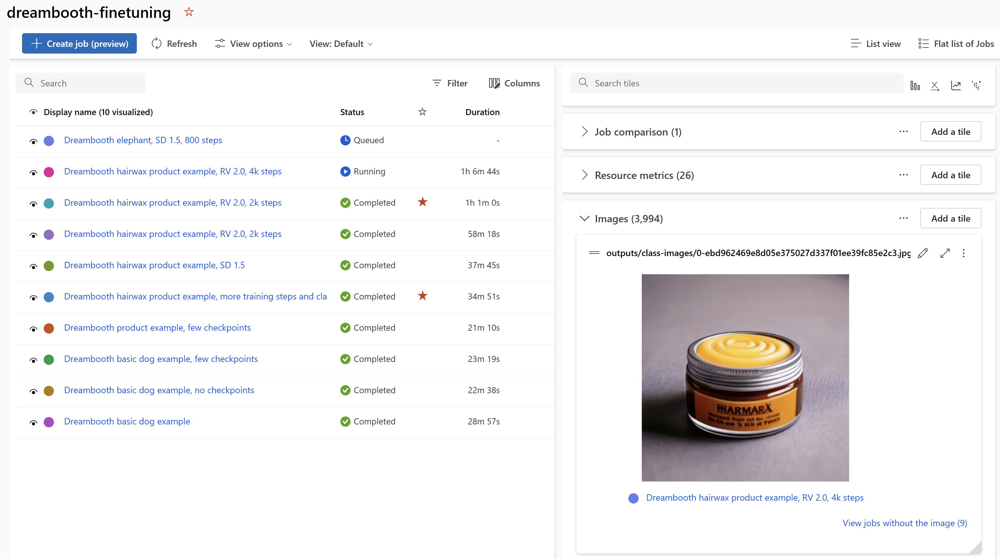
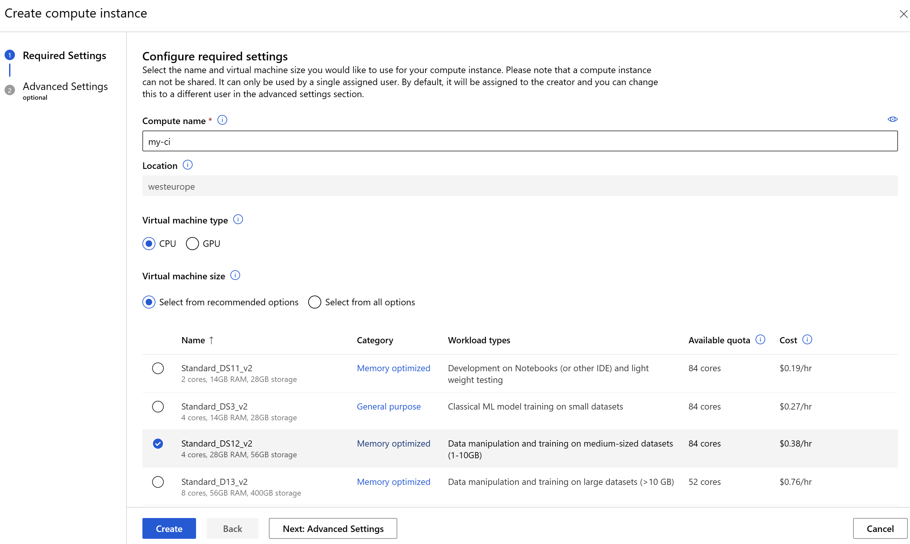

# Add your Objects and Styles to Image Generation Models

This solution enables you to inject any object into an existing image generation model like Stable Diffusion using a few example images.
It can also be used for teaching artistic styles (e.g., company branding photography).

## Managing Generative Computer Vision Experiments with Azure Machine Learning

Azure Machine Learning facilitates advanced Generative AI use cases with its robust resources and efficient experiment management capabilities.



- Powerful GPU clusters enable multiple resource-intensive fine-tuning runs concurrently.
- Azure ML provides a framework to manage all associated artifacts, including image datasets, environments, and the resulting models, in a systematic and repeatable manner.
- The platform's experiment management feature allows maintaining control over numerous training runs, while effectively tracking hyperparameters and results

## Prerequisites

An Azure subscription is needed to use this example.  
We are using an Azure Machine Learning Workspace for managing finetuning jobs on scalable GPU resources.
- You need an __Azure Subscription ID__ and permissions for creating your own __Resource Group__

- If you don't have an Azure subscription, check out [these options](https://azure.microsoft.com/us-en/free).

## Getting started

[Click here to use the Azure Cloud Shell](https://shell.azure.com) to execute the following steps:

### 1. Create a resource group named __gencv__ in the __West Europe__ region. Feel free to adjust name and region according to your preferences:
```bash
az group create -l westeurope -n gencv  
```
### 2. Create Azure ML Workspace: 

Use this example to create a Workspace with name  __gencv-workspace__. It will use the resource group region:
```bash
az ml workspace create -g gencv -n gencv-workspace
```
### 3. Select preferred Development Compute 

There are several options to run the solution:

- On your local computer or cloud
- [GitHub Codespaces](https://github.com/features/codespaces) compute
- Azure Machine Learning Compute Instance

For creating a Compute Instance, use the [Azure ML Studio](https://ml.azure.com/) and navigate to the Compute tab of the Workspace you have created in the previous step. Click the __+ New__ button to select your desired configuration:



For managing the training jobs, a `Standard_DS12_v2` CPU Instance is sufficient. You can also create a GPU Instance (for example `Standard_NC6s_v3`) if you wish to generate a high number of images with your fine-tuned model later.

### 4. Run orchestration notebook

Navigate to the [Dreambooth finetuning notebook](./finetuning-dreambooth.ipynb) and follow the included instructions.

### 5. Clean up (__Warning__: This command will delete the resource group and all its resources):  
```bash
az group delete -n gencv
```
## References

[1] Patrick von Platen, Suraj Patil, Anton Lozhkov, Pedro Cuenca, Nathan Lambert, Kashif Rasul, Mishig Davaadorj, Thomas Wolf. (2022). Diffusers: State-of-the-art diffusion models. GitHub. Available at: [https://github.com/huggingface/diffusers](https://github.com/huggingface/diffusers)  
We have reused the dreambooth `dreambooth.py` training script with minor adjustments.