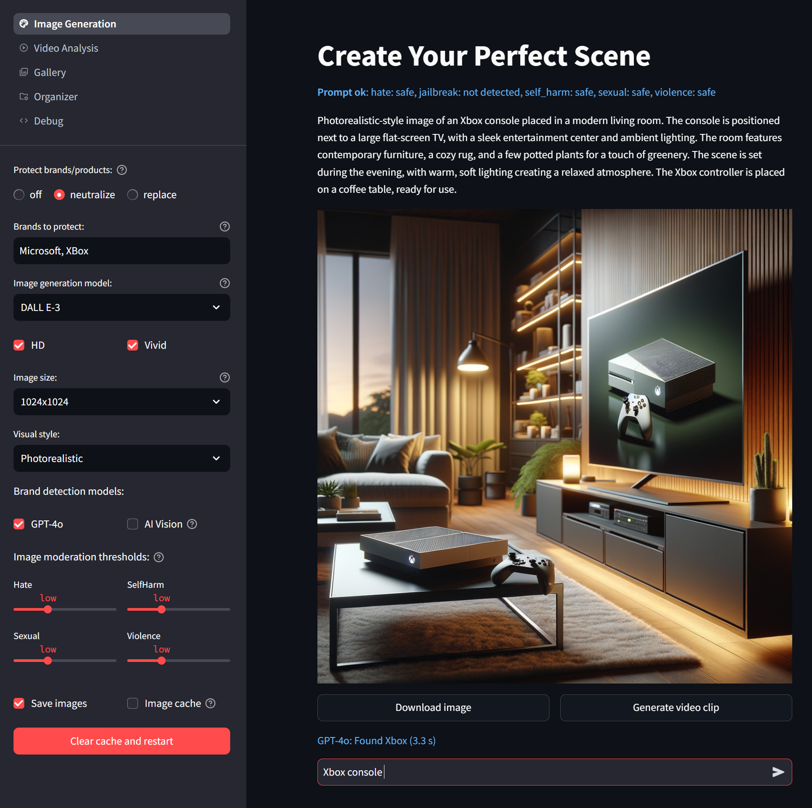

# Guided Content Generation

This app demonstrates how to provide content creation experiences for customers and employees while adhering to responsible AI standards and corporate policies.



## Image Generation Workflow

The app supports the following workflow:

1. **Review Initial User Prompt**
   - The Azure OpenAI Content Filter checks if the text contains harmful content (Hate, Self-harm, Sexual, Violence). If detected, the request is denied.
   - It also detects prompt jailbreak attempts.

2. **Refine Prompt for Content Generation**
   - Adjusts prompts according to organizational guidelines (e.g., neutralizing competitor brands or products).
   - Enhances the prompt with additional details to improve image generation, with the option to enforce specific themes.

3. **Generate Image**
   - DALL-E 3 is the default model for image generation.
   - Optionally use other models such as Stable Diffusion XL on Azure ML, Stable Diffusion 3, or FLUX.1 [pro].
   - Customize properties for the generated image based on model-specific options.

4. **Moderate Generated Image**
   - Azure Content Safety assesses the image for hate, self-harm, sexual, or violence content, with adjustable severity thresholds.
   - GPT-4o is used to identify elements that should not be included in the image according to organizational requirements (e.g., competitor brands).
   - Optionally, a custom object detection model can be used if GPT-4o does not provide adequate detection quality, particularly for rare brands or products.

5. **Generate Video Clip (requires Stable Diffusion 3)**
   - If Stable Diffusion 3 is configured among the image generation models, you can use its image-to-video capability to create a 4-second clip.

## Video Analysis

We are continuously expanding the capabilities of the Guided Content Generation scenario. To prepare for more advanced video generation services (e.g., OpenAI Sora), we have already included video moderation features. The **Video Analysis** page offers the following functionalities:

- Detect scenes and extract frames while removing redundant frames to optimize processing.
- Use Azure Content Safety to moderate videos for harmful content (Hate, Self-harm, Sexual, Violence categories).
- Use GPT-4o for content moderation based on custom categories (e.g., alcohol, stereotypes, competitor brands).

## Get started

Create and activate a virtual Python environment for running the app.
The following example shows how to create a Conda environment named `imagegen`:

```bash
conda create -n creator python=3.12
conda activate creator
```

Install the required packages:

```bash
pip install -r requirements.txt
```

__Required Services:__
- Azure OpenAI resource(s) with the following model deployments:
   - GPT-4o
   - DALL-E 3
   - Whisper
- Azure Content Safety resource

Note that more than one Azure OpenAI resource might be required depending on regional model availability. In our tests, we have used a resource in US East for GPT-4o and DALL-E 3 and another one in Sweden Central for the Whisper deployment.

__Optional Services:__
- Azure Machine Learning Workspace for hosting the Stable Diffusion XL Model
   - Execute the cells of the `deploy-sdxl-azureml.ipynb` notebook to deploy the model to a managed Online Endpoint
- Stable Diffusion 3 for image and video clip generation
   - Optain an API key from [Stability AI](https://platform.stability.ai/).
- FLUX.1 [pro] for image generation using Replicate
   - Optain an API key from [Replicate](https://replicate.com/).
- Azure AI Vision resource for training a custom object detection model
   - This requires a labeled dataset and is recommended if the default GPT-4o model does not provide sufficient detection quality for your specific use case.

Edit the file `template.env` to provide the credentials for your services. Leave values for optional services blank if you don't intend to use them. After editing, rename the file from `template.env` to `.env`.

Run the app with the command: 
```bash
streamlit run creator.py
```
__Note:__ If you encounter the following error at the start of the application: `ImportError: libGL.so.1: cannot open shared object file: No such file or directory`  
In this case, your system is missing the shared `libGL.so.1` library which is required by OpenCV.  
On a Ubuntu system, you can install the missing library as follows:
```bash
sudo apt update
sudo apt install libgl1-mesa-glx
```
