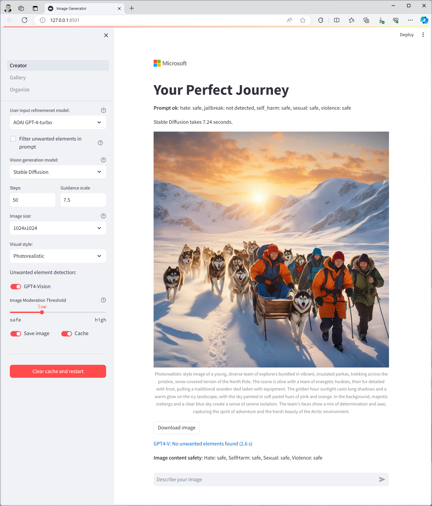

# Guided Image Generator

This app provides options for image generation based on a predefined theme and compliance regarding unwanted NSFW-content and organizational policies (e.g., avoid generation of competitor elements).



The demo showcases the following process:

1. Azure Content Safety - Analyze user's input:
   - Azure Content Safety flags if the text contains Hate, Self-harm, Sexual, or Violence content. If detected, the request is denied. 
   - It also checks for prompt jailbreak attemps by the user.

2. Azure Open AI GPT 3.5/4 Turbo - Prompt refining:
   - Improves the prompt with additional details to improve image generation with the option to enforce a specific theme.
   - Detects and modifies unwanted terms.

3. DALL-E 3 / Stable Diffusion - Image generation based on the improved prompt:
   - DALL-E 3 is the main model for image generation.
   - Deploy Stable Diffusion XL on an Azure ML Service, as an alternative.

4. GPT 4 Vision - Review the generated image:
   - Check to detect any elements that should not be included in the image.

5. Azure Content Safety - Analyze the generated image:
   - Azure Content Safety flags if the image contains Hate, Self-harm, Sexual, or Violence content.

6. Azure Open AI GPT 3.5/4 Turbo - Text generation:
   - Generates text related to the user's input using the refined prompt.

## Get started

Create and activate a virtual Python environment for running the app.
The following example shows how to create a Conda environment named `imagegen`:

```bash
conda create -n imagegen python=3.10
conda activate imagegen
```

Install the required packages:

```bash
pip install -r requirements.txt
```
Optional: If you want to deploy Stable Diffusion XL as a an alternative image generation model, execute the cells of the `deploy-sdxl-azureml.ipynb` notebook. 

Edit the file `.env` with your data:
- AOAI_ENDPOINT=[YOUR-AZURE-OPENAI-ENDPOINT]
- AOAI_KEY=[YOUR-AZURE-OPENAI-KEY]
- AOAI_GPT_4=[YOUR-AZURE-OPENAI-GPT-4-DEPLOYMENT-NAME]
- AOAI_GPT_35=[YOUR-AZURE-OPENAI-GPT-3.5-DEPLOYMENT-NAME]
- AOAI_GPT_4_VISION=[YOUR-AZURE-OPENAI-GPT-4-VISION-DEPLOYMENT-NAME]
- AOAI_DALL_E=[YOUR-AZURE-OPENAI-DALL-E-DEPLOYMENT-NAME]
- ACS_ENDPOINT=[YOUR-AZURE-CONTENT-SAFETY-ENDPOINT]
- ACS_KEY=[YOUR-AZURE-CONTENT-SAFETY-KEY]
- AML_IMGEN_URL=[YOUR-STABLE-DIFFUSION-ENDPOINT]
- AML_IMGEN_API_KEY=[YOUR-STABLE-DIFFUSION-KEY]
- AML_IMGEN_NAME=[YOUR-STABLE-DIFFUSION-DEPLOYMENT-NAME]


Edit the config file `config-journey.json` with your specific data for your purposes:

- TITLE: The title for the page and the top message.
- BASIC_SYSTEM_MESSAGE: The system prompt to instruct GPT3.5/4 to generate the prompt for DALL-E 3.
- UNWANTED_ELEMS_SYSTEM_MESSAGE: The system prompt to instruct GPT3.5/4 to generate the prompt for DALL-E 3 and also to substitute unwanted terms for neutral terms.
- STABLE_DIFFUSION: True or False. If this parameter is True, a list of image generation models will be displayed, Dall-E and Stable Diffusion. If Stable Diffusion is selected, it will be used to generate the image.
- STYLES: The list of image styles to be generated.
- GPT4V_SYSTEM_MESSAGE: The system prompt for GPT4V to review the generated image to detect unwanted terms and how it has to answer.
- GPT4V_USER_PROMPT: The user prompt for GPT4V to review the generated image to detect unwanted terms
- TEXT_GENERATION: True or False. If this parameter is True, the list of languages will be presented, and a text related to the user input will be generated, following the Text generation prompt configured in the parameter TEXT_GENERATION_PROMPT.
- TEXT_GENERATION_LANGUAGES: The list of languages for text generation.
- TEXT_GENERATION_PROMPT: The system prompt to drive the text generation, using the selected language.


Run the app with the command: 
```bash
streamlit run Creator.py
```

