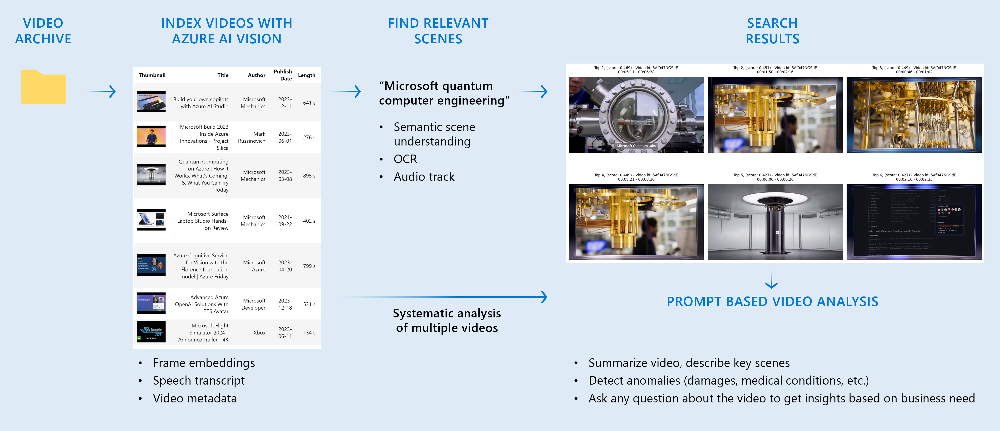

# Find and Analyze Videos using Azure OpenAI GPT4-Vision with Video Enhancements



This solution accelerator presents a detailed framework for analyzing videos, leveraging Azure OpenAI GPT4-Vision with Video Enhancements technology.  
It's a crucial resource for businesses across a range of industries, including marketing, media, education, manufacturing, healthcare, and retail.

## Getting started

1. Create an Azure Storage Account resource
   - Create a Blob container named `videos`
   - Generate a SAS token for the `videos` container with Read, Add, Create, Write, Delete and List permissions. Ensure that the Expiry date covers the duration of your use case.
2. Create an Azure OpenAI resource in the Sweden Central or Switzerland North region
   - Deploy the GPT4 vision-preview model
3. Create an Azure Computer Vision resource in the same region as the OpenAI Service
4. Use your preferred Python IDE to open the `find-and-analyze-videos.ipynb` notebook
   - We have developed it in a conda environment on GitHUb Codespaces with Python 3.10  
   ```bash	conda create -n vision python=3.10```

   - Using VSCode ensures full compatibility with video playback in the notebook
   - Use the `requirements.txt` file to install the required packages in your environment  
   ```bash	pip install -r requirements.txt```
5. Rename the `dotenv` template to `.env` and populate it with the required parameters and credentials for the Azure resources.
6. We have provided a couple of sample videos in the `videos` folder for a quick start. Feel free to add your own videos.

__Note__: In case of an import error related to libGL.so.1 and the cv2 library, you can manually install the required components (Ubuntu example):
``` bash
sudo apt-get update
sudo apt-get install libgl1-mesa-glx
```
