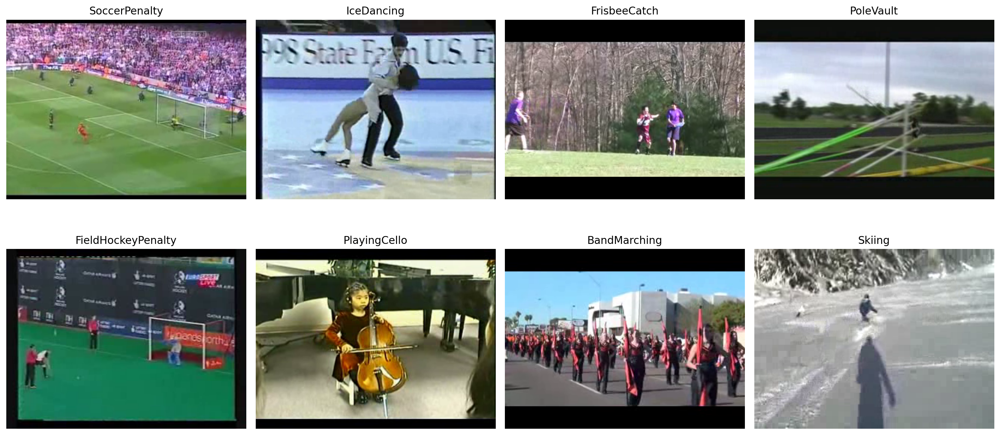

# Fine-Tuning GPT-4.1 for Action Recognition in Video Clips

This Solution Accelerator demonstrates how to use Azure OpenAI GPT-4.1 vision fine-tuning to improve the model's performance in detecting human activities in video clips. The project utilizes the [UCF101 - Action Recognition](https://www.kaggle.com/datasets/matthewjansen/ucf101-action-recognition) dataset from Kaggle, a comprehensive video dataset featuring 101 distinct human action categories such as "playing guitar," "surfing," and "knitting." It contains 13,320 video clips, each labeled with a single action category.

Below are examples of video frames representing 8 of the 101 classes in the dataset:



__Acknowledgements:__

- Dataset: https://www.crcv.ucf.edu/research/data-sets/ucf101/
- Citation: https://arxiv.org/abs/1212.0402

This Solution Accelerator provides reusable code to help you apply vision fine-tuning for video analysis in various use cases.

> **Note:** By default, the Fine-Tuning API rejects images containing people and faces for AI safety reasons.
You can apply to opt out of this limitation by submitting a request here: https://customervoice.microsoft.com/Pages/ResponsePage.aspx.
Make sure to select the Modified Content Filtering option for Inferencing and Fine Tuning in question 14.


## Get started

Create and activate a virtual Python environment for running the code.
The following example shows how to create a Conda environment named `video-ft`:

```bash
conda create -n video-ft python=3.12
conda activate video-ft
```

Install the required packages. Navigate to the `02-AOAI-video-fine-tuning` folder and execute the following:

```bash
pip install -r requirements.txt
```

__Required Services:__
- An Azure OpenAI resource with the following model deployments:
   - GPT-4.1

__Optional Services:__
- Azure AI Foundry for managing fine-tuning in the UI
- An Azure Storage Account

Rename the environemt file template `.env.template` to `.env` and add your credentials by editing the file.

Navigate to the video fine-tuning notebook:

- [Fine-Tuning GPT-4.1 for Action Recognition in Video Clips](fine-tune-aoai-gpt4-1-action-detection.ipynb)

__Note:__ If you encounter the following error: `ImportError: libGL.so.1: cannot open shared object file: No such file or directory`  
In this case, your system is missing the shared `libGL.so.1` library which is required by OpenCV.  
On a Ubuntu system, you can install the missing library as follows:
```bash
sudo apt update
sudo apt install libgl1-mesa-glx
```